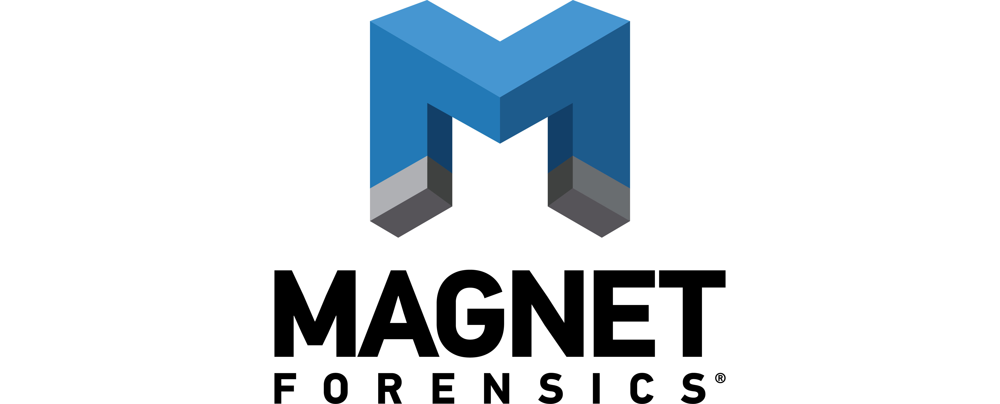

# Working at Magnet Forensics
In this post I will be discussing my recent 4-month work term as a **Software Developer Co-op** at [Magnet Forensics](https://www.magnetforensics.com). I'm a computer science major (Bachlor of Computing) going into my fourth year of school at the [University of Guelph](https://www.uoguelph.ca). This was my third work term so far, my first [two terms being spent at MappedIn](https://kanoa.tech/blog/mappedin-work-term-report). I hope that this post may provide some insight into my experience at Magnet and maybe even teach you something new!

### Sections
- [About Magnet](#about-magnet): Short introduction to Magnet Forensics.
- [Learning Goals](#learning-goals): My three learning goals during my term.
- [My Job at Magnet](#my-job-at-magnet): Summary of my job at Magnet Forensics.
- [Academic Connections](#academic-connections): Brief discussion of the relation of my term to my studies.
- [Conclusion](#conclusions): Quick overview of the above sections.
- [Kudos](#kudos): Brief acknowledgements to those who helped me so much!

# About Magnet
// TODO

# Learning Goals
Soon after I started my term at Magnet, I set out to achieve a set of goals that I knew I could work towards during my entire term. I choose three goals that I believed would be important and provide many learning opportunities while I was working at Magnet.

One key point I had in mind when choosing my own learning goals was what Magnet could provide me. I wanted to learn about how our software is used so I could become a more well-rounded developer. That is why I choose that as the focus of two of my goals.

### 1. Understanding the role of digital forensics during an investigation.
// TODO: Clean up

I want to understand the criminal investigation and examination process, and in particular the role of forensics during an investigation.

To achieve this goal, I will seek out individuals who work in the field and shadow as many opportunities as possible.

I can base my progress (and hopefully success) of this goal upon my own understanding of the investigation process. I will have succeeded if I have a basic but complete understanding of the investigation process.

### 2. Becoming competent at back-end development in Clojure.
// TODO: Clean up

I want to improve my skills in full-stack software development involving ECMAScript and Clojure.

I will continuously seek criticism involving my work as well as taking advantage of company resources and experienced co-workers.

Since this goal revolves around general improvement, I can say that if my skills are better than they were when I started, I have achieved my goal.

### 3. Ability to perform a digital forensics search.
// TODO: Clean up

I want to be able to conduct a digital forensics examination of my own without the use of advanced forensic tools.

I will take advantage of all the company resources as well as practice digital forensics with and without the use of tools throughout my work-term.

I should be able to successfully acquire and analysis a mobile and computer system.

# My Job at Magnet
I worked at Magnet as a **Software Developer Co-op**. During my term I spent the majority of my time working on the **D**igital **E**vidence **M**angement (or DEM for short) team. I worked as a full-stack developer with my primary focus being [Magnet AUTOMATE](https://www.magnetforensics.com/products/magnet-automate/), a workflow orchestration product designed to reduce case back log for law enforcement.

While working as a developer at Magnet, my responbilities included maintaining existing software, implementing new features, and ensuring the quality of our software. I developed in multiple environments including front-end web applications, distributed backend servers, and high-performance processing applications. My role there was as a full-stack developer spanning accross many products at times.

# Academic Connections
// TODO

# Conclusion
// TODO

# Kudos
As a final note, I want to give my kudos to some of the people who helped me throughout my term and provided support. They were much deserve some acknowledgement.

Q
// TODO

Will
// TODO

Jason
// TODO

Kellen
// TODO

