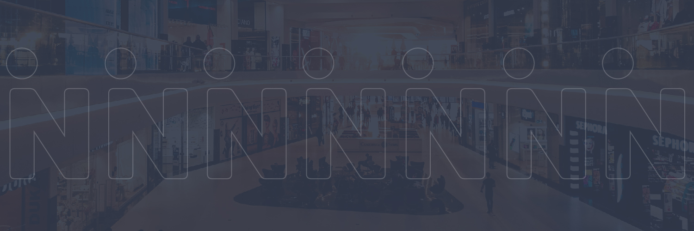
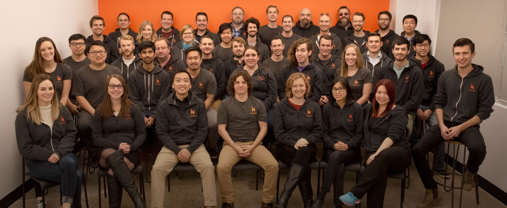
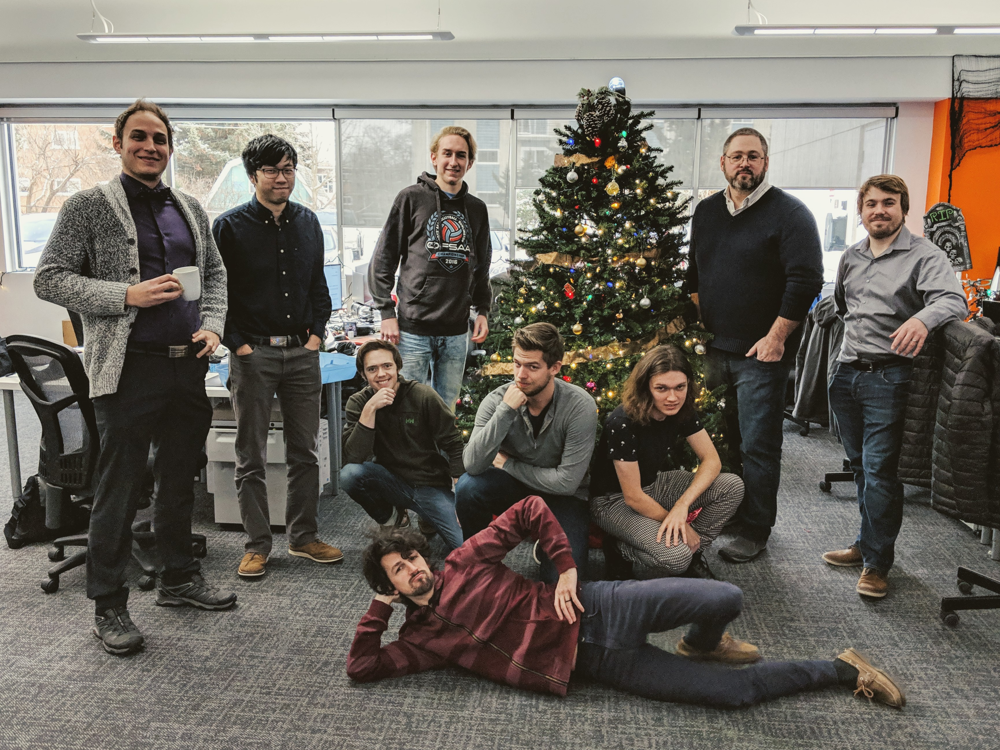

# Working at Mappedin
I recently completed a two term co-op at [Mappedin](https://mappedin.com/), an indoor wayfinding startup located in KW. I worked as a full-stack software developer on their enterprise team. This was my second job as a full-stack dev, but my first time working on a team with many moving parts. In this post, I will dive into my wonderful experience while working at Mappedin. I hope you'll enjoy my journey and learn a bit about me and Mappedin.

## Who is Mappedin?
Have you ever been shopping at a mall and used one of those digital maps? Then there's a good chance you've used some of Mappedin's software!  

> We’re making the indoors discoverable by building the word processor for indoor mapping.

Mappedin is a relatively young company based out of Waterloo (and previously Kitchener) that primarily develops indoor wayfinding experiences as well as enterprise grade maintenance and mapping tools. Our wayfinding software is currently used by nine out of ten of the largest malls in Canada, the two largest malls in the US, and many other malls world-wide. Mappedin's goal is to make the indoors more discoverable in retail outlets, stores, malls, campuses, airports, and more all around the world!

Mappedin is currently made up of about 60 employees working in all sorts of departments. Currently, our biggest department is software development, with about 30 people split into individual teams. During my time at Mappedin, I worked on the enterprise team within the software development department.

Mappedin was started in 2011 by a few students at the University of Waterloo. Now, seven years later, it has grown into an international company that impacts millions of people every single day. To summarize, I'll let Mappedin's own [FAQ](https://mappedin.com/faq) do the talking:

> Mappedin is an indoor GIS (geographical information system). In more general terms, we’re a management and productivity tool that delivers a dataset of what’s indoors. This dataset allows property owners and operators to do their jobs better, be more productive and provide better digital experiences to their visitors.

## My Goals
// TODO: Write this section

## The Job
My job description while I was there

## Relation to my Studies
// TODO: Write this section

## Conclusion
// TODO: Write this section

## Shoutouts
During my terms at Mappedin, there were so very many people who helped and guided me along the way. I would like to give them all a shout out, but that would take up way too much space. Instead, I would like to acknowledge the people who were pivotal to my work term, my professionally development, and/or contributed to my work towards my goals during the term.

To start, I owe much thanks to my supervisor/manager [Kyle Lewis](https://www.linkedin.com/in/spectacledbear/), who made my entire time at Mappedin wonderful and seamless. In my mind, he has captured exactly what it is to be an amazing leader and manager. He works tirelessly to ensure his whole team is happy and productive, and he does it so well that you may not even notice how great everybody works together. Plus, if you ever have a concern, or a worry, you would never be hesitant to head to Kyle to get it resolved, and you could expect that he will understand and take action. Thank you Kyle, for never settling, never giving up, and always being available and encouraging.

Beyond my manager, I worked closely with [Brad Harris](https://www.linkedin.com/in/brad-harris-20943a17/), my team's technical lead. He was the person who got stuck answering all my questions and helping with all my problems when I started. Despite that, he was always excited to help and would push you into the correct solution in no time. In my mind, Brad is definitely some sort of genius programming machine, his ability to create efficient and intuitive designs was incredibly impressive. But at the same time, Brad was always a cheerful guy and easy to get along with. During my terms, Mappedin had a goal to build their own rock climbing wall. With Brad's help, him and I were able to finish it before I had to leave, mostly thanks to his tireless effort and contagious passion. So, thank you Brad, for teaching me so much more about software development, and most importantly, being a great pal!

Finally, I would like to give a shoutout to [Amaris Gerson](https://www.linkedin.com/in/amarisgerson/), a recruiter at [Square](https://squareup.com/ca). Without her help, I would never have been able to get this job and experience. Before I interviewed at Mappedin, back in February of 2018, I was actually looking into working at Square, but sadly I was unable to get an offer for the position I was working towards. Instead of giving up on me, Amaris sent an absolutely glowing referral to [Joanna Woo](https://www.linkedin.com/in/joannawoo/) (who deserves a whole shoutout of her own), a recruiter at Mappedin, which ended up in an interview there. Thanks to her, I was able to work at Mappedin!
