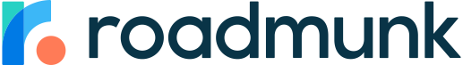

# Working at Roadmunk
Over the course of the past eight months, I spent my time on a co-op work term at [Roadmunk](https://roadmunk.com/). I worked as a **Web App Developer** on a small team during Roadmunk's transition to remote work. I'm a computer science student at the [University of Guelph](https://www.uoguelph.ca) going into my fifth and final year at school. In this post, I will be discussing these past eight months I spent at Roadmunk. I hope to provide some insight and entertainment!

### Sections
- [About Roadmunk](#about-roadmunk): Overview of Roadmunk from my point of view.
- [Learning Goals](#learning-goals): Insight into my major learning goals for my term.
- [Life as a Web App Developer](#life-as-a-web-app-developer): Description of my job.
- [Conclusion](#conclusions): Wraps this post up.

# About Roadmunk
Roadmunk is a medium sized company based in Kitchener and Toronto that creates and sells product roadmapping tools. Essentially, Roadmunk builds the tools that other individuals, groups, and companies can leverage while creating a product roadmap or other feedback based roadmap. Some of Roadmunk's customers include Amazon, Nike, and Mastercard.

Roadmunk currently has two offices, one in Toronto with around 10-30 employees as well as a engineering focused office in Kitchener with around 50-80 employees. I spent the first portion of my term at the Kitchener office, but had to transition to full work-from-home once lockdowns come into effect as a result of COVID.

Company culture at Roadmunk is absolutely fantastic as a young developer. Most teams are fairly small and tightly knit so you get to know your peers quite well. As well, the kitchen was always stocked up on drinks and snacks to keep us going!

# Learning Goals
As part of the co-op process, I set out to define a set of goals that I could work towards throughout my time at Roadmunk. Initially, I created three different goals. Sadly, as a result of a team restructuring, I was not able to use the technology I needed for one of my goals. Instead of starting a new goal midway through the term, I decided to put all my focus into my two other goals. Below I explain what my goals were and how I progressed towards them.

### 1. Depth & Breadth of Understanding
My primary learning goal for my time at Roadmunk was rather simple: I wanted to take advantage of my experienced co-workers and mentors to greatly improve my understanding of the tech we used. I have quoted my goal as I first wrote it below.

> I would like to diversify my technical skills and knowledge to be more applicable to handle any task that may come my way.

For this goal, I went out of my way to take on new and foreign tasks as well as constantly reached out to the available mentors for feedback and suggestions. I was able to learn a lot both independently through new work and even more through the help of my co-workers.

I believe I was able to achieve my goal. But after reflecting on the goal more, I have decided to create future goals with more measurable success metrics.

### 2. Written Communication
When it comes to software development, it is my opinion than communication is the most important skill to being a valuable employee and team member. To progress and become a constantly better developer myself, I must always be improving my communication skills. Sadly, communication is a massive category of different skills and cannot be focused on as a whole for a singular goal. For this term, I choose to focus on technical writing and documentation. This leads to my second goal which I have left below as it was originally written.

> I want to improve my technical writing and documentation skills to the point where I am able to successfully document all my work and resources concerning my work.

One of the most effective methods I used while working towards this goal was keeping honest feedback on as much of my writing as I could. Thanks to the help of both my supervisor and co-workers, I was able to see issues with my writing and work on fixing or improving it. In the end, I was assigned to document and define our internal OAuth system as well as present it to the engineers at our company. This was a fantastic opportunity and allowed me to show off how much I had improved over my term.

Thanks to reviewing my own documentation and feedback from my supervisor, I can confidently say I achieved this goal. Though communication is such an important skill that I will always need to work on it and will need to set higher goals for myself.

# Life as a Web App Developer
Despite my job title of **Web App Developer**, I spent most of my time at Roadmunk doing server-side development. As a co-op, my team had low expectations and were prepared for a long onboarding period. Luckily for both me and my team, our work was in **JavaScript** with most of our code living in **NodeJS** based servers. Because of my past experience with a majority of the technologies used by my team, I was able to get up and running quickly. Within my first week I had already contributed multiple changes to our production code. This proved very beneficial since our team was able to meet our goals with less concern and no rush thanks to the quicker than expected onboarding period (in regards to tech at least).

When I first started at Roadmunk, I worked on our internal tools team doing small changes and building simple tools. Quickly after joining though, I was lucky enough to join the auth team. Our team, auth, was dedicated to building out Roadmunk's authentication and authorization platforms and libraries. This gave me an incredible chance to get a head start on my security course. Additionally, I have came away from the term with a very solid knowledge and practice in regards to **OAuth** and **SAML** protocols.

# Conclusion
This term was bittersweet for me overall. I had an incredibly fun time at Roadmunk and learned more than ever before but I also had to contend with the effects of the global coronvirus pandemic during my term. I ended up becoming much ore productive as a fully remote employee and ended up meeting even more co-workers since we were no longer separated by different offices! I am happy to have spent my time at Roadmunk and learn as much as I did but I will always look back on this term as one of my most notable work experiences.
